# Google - AutoML Modeling Report

## TODO - OVERVIEW...

### Binary Classifier with Clean/Balanced Data

**Train/Test Split**

How much data was used for training? How much data was used for testing?

* 200 images (100 for each label: pneumonia and normal) were used for training.
* 14 images of each label were used for testing. 

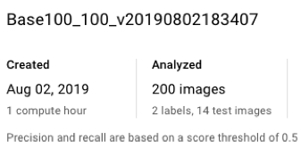

**Confusion Matrix**

What do each of the cells in the confusion matrix describe? What values did you observe (include a screenshot)? What is the true positive rate for the “pneumonia” class? What is the false positive rate for the “normal” class?

The Confusion Matrix grid shows all the predicted labels relative to all the true labels (or, what is the same, each cell shows the relation between the true label and the predicted label).

The values across a row should add up to 100%. Values in the columns have no limitations. 

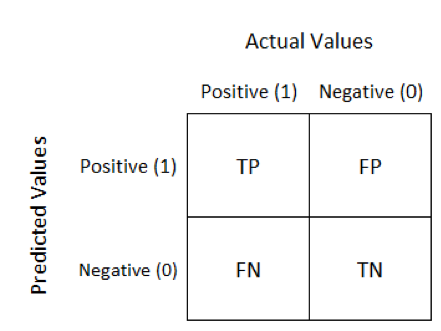
*Image credits*: https://twitter.com/narkhede_sarang

The cells show:
1. TP: True Positive. Example: we predicted pneumonia and it is pneumonia.
2. FP: False Positive. Example: we predicted pneumonia and its is normal. 
3. FN: False Negative. Example: we predicted that is NOT pneumonia and it IS pneumonia.
4. TN: True Negative. Example: we predicted that is NOT pneumonia and it is NOT pneumonia.

The result was…
* 100% of the true cases of the label “normal” were classified as “normal” 100% of the times
* 100% of the true cases of the label “pneumonia” were classified as “pneumonia” 100% of the times.

The true positive rate for the “pneumonia” class was 100%.
The false positive rate for the “normal” class was 0%.

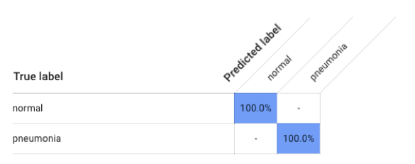

**Precision & Recall**

What does precision measure?
What does recall measure? What precision and recall did the model achieve (report the values for a score threshold of 0.5)?

Precision measures the percentage of correct predictions against total number of predictions.  
Formula: TP / (TP + FP)

Recall measures the percentage of correctly identified instances of total possible instances.
Formula: TP / (TP + FN)

Or, from Google’s Docs… “Precision and recall help us understand how well our model is capturing information, and how much it’s leaving out. Precision tells us, from all the test examples that were assigned a label, how many actually were supposed to be categorized with that label. Recall tells us, from all the test examples that should have had the label assigned, how many were actually assigned the label”

* Score threshold: 0.50
* Recall: 1.000
* Precision: 1.000

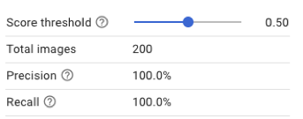

**Score Threshold**

When you increase the score threshold, what happens to precision? 
What happens to recall? Why?

If we increase the threshold our model will classify fewer images, but it will have a lower risk of misclassifying these assets (model will have more confidence)
In consequence…
* Precision will increase
* Recall will decrease 

Side note: if we decrease the threshold, our model will; classify more images but with less precision (risk of misclassifying assets)

### Binary Classifier with Clean/Unbalanced Data

**Train/Test Split**

How much data was used for training? How much data was used for testing?

* 400 images (100 for normal and 300 for pneumonia) were used for training.
* 45 images of each label were used for testing. 

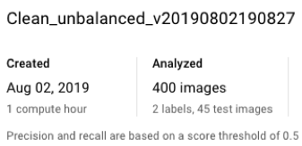

**Confusion Matrix**

How has the confusion matrix been affected by the unbalanced data? Include a screenshot of the new confusion matrix.

In our evaluation 10.8% of true cases of pneumonia were classified as normal.

*IMPORTANT:*

This is a strange output. 
I would expect to have more images classified as pneumonia since we are “biasing” the model using 3 times (300) the quantity of assets for pneumonia in relation to normal (100).
I talked with my mentor and she told me to re build the model, however, I’m still receiving a result similar to the previous one. 

However, to answer the rubric’s question… In unbalanced/clean, model will bias towards the label or class with more images. In this case, pneumonia. Or what is the same, in the Confusion Matrix we could see cases of normal flagged as pneumonia since our model will classify more cases as pneumonia and less as normal.

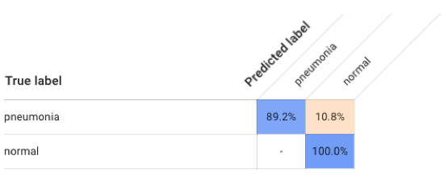

**Precision & Recall**

How have the model’s precision and recall been affected by the unbalanced data? (Report the values for a score threshold of 0.5.)

* Precision: 91.1%
* Recall: 91.1%

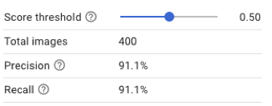

Compared with the clean/balanced data, both, precision and recall decreased.

**Unbalanced classes**

From what you’ve observed, how do unbalanced classes affect a machine learning model?

It generates bias making the model tend to the “most common” label (aka, misclassification).

### Binary Classifier with Dirty/Balanced Data

**Confusion Matrix**

How has the confusion matrix been affected by the dirty data?
Include a screenshot of the new confusion matrix.

In our evaluation 50% of true cases of normal were classified as pneumonia.
And, 27.3% true cases of pneumonia were classified as normal.

Both precision and recall decreased to 63.2% and we have a big number of images wrong labeled. In consequence, our model is erroneously trained flagging cases of pneumonia as normal (and vice versa) what’s reflected in the Confusion Matrix. 

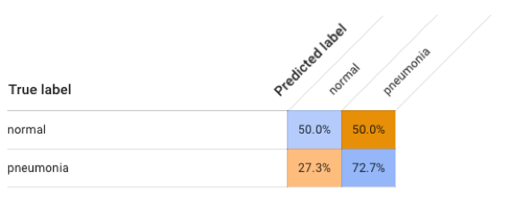

**Precision & Recall**

How have the model’s precision and recall been affected by the dirty data? (Report the values for a score threshold of 0.5.) Of the binary classifiers, which has the highest precision? Which has the highest recall?

* Precision: 63.2%
* Recall: 63.2%

We have an important percentage of misclassified images.

* A score threshold of 0 has the highest Recall: 100% (and Precision of 50%) 
* A score threshold of 1. Has the highest Precision: 100% (and Recall of 0%)

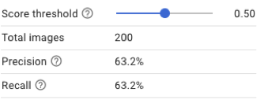

Models…
1.	Clean/balanced data
Here, both, precision and recall are perfect (100%) since we are providing the same number of images for each class.
    * Precision: 100%
    * Recall: 100%
2.	Clean/unbalanced data
Here, both, precision and recall decreased since our model is biased toward the class with more images (misclassification by bias) 
    * Precision: 91.1%
    * Recall: 91.1%
3.	Dirty/Balanced data
Here, both, precision and recall decreased since our datasets have wrong images (misclassification by bad labeling). Our model is trained to fail or have a poor performance compared with clean/balanced data.
    * Precision: 63.2%
    * Recall: 63.2%

Clean/Balanced data model has the best precision and recall.

**Dirty Data**

From what you’ve observed, how do dirty data affect a machine learning model?

Depending on the quantity, it can ruin the model completely (example, if most of the data is dirty or with wrong labels). Also, dirty data needs a bigger dataset and a bigger number of test images to decrease wrong outputs.

In our evaluation we have 50% of normal cases flagged as pneumonia and 27.3% of pneumonia cases flagged as normal. 

### Binary Classifier with Dirty/Balanced Data

**Confusion Matrix**

Summarize the 3-class confusion matrix. What classes are the model most likely to confuse? What class(es) is the model most likely to get right? What might you do to try to remedy the model’s “confusion”?

The most likely to confuse are bacterial pneumonia and viral pneumonia. 
The most likely to get right, normal (100%)

I would increase the number of both, bacterial and viral pneumonia (in the same proportion) and balance the relation between normal and pneumonia labels. Currently we have 100 for viral, 100 for bacterial and 100 for normal. I would change the distribution to 100 to viral, 100 to bacterial and 200 to normal (since both, viral and bacterial are subtypes of pneumonia). 

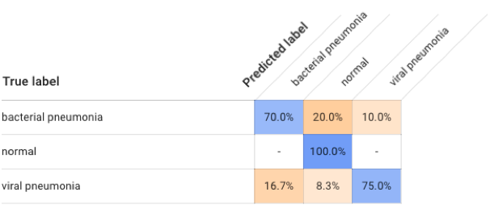

**Precision & Recall**

What are the model’s precision and recall? How are these values calculated? (Report the values for a score threshold of 0.5.)

* Precision: 80.6% and is calculated through… 
true positives / model predictions (true and false positives) 

* Recall: 80.6% and is calculated through…
true positives / ground truth positives (true positives and false negatives)

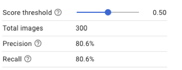

**F1 Score**

What is this model’s F1 score?

F1-Scofe combines precision and recall to produce an overall performance measure of the model.  

Precision pneumonia bacterial
    
    Correctly predicted: 70%
    Total predicted: 70.0% + 16.7% =  86.7%

    70% of 100 images = 70 images
    16.7% of 100 images = 16.7 images

    Precision: 70 / 86.7 = 0.807

Precision normal

    Correctly predicted: 100%
    Total predicted: 100% + 20.0% + 8.3%

    Precision: 100 / 128.3 = 0.779

Precision pneumonia viral

    Correctly predicted: 75%
    Total predicted: 75.0% + 10% =  85%

    75% of 100 images = 75 images
    10% of 100 images = 10 images

    Precision: 75 / 85 = 0.882

**Model Precision:**
(0.807 + 0.779 + 0.882) / 3 = 0.8226

Recall pneumonia bacterial

    Correctly predicted: 70%
    Real labels: 100

    70% of 100 images = 70 images

    Recall = 70 / 100 = 0.7

Recall normal

    Correctly predicted: 100%
    Real labels: 100

    100% of 100 images = 100 images

    Recall = 100 / 100 = 1

Recall pneumonia viral

    Correctly predicted: 75%
    Real labels: 100

    75% of 100 images = 75 images

    Recall = 75 / 100 = 0.75

**Model Recall:**
(0.7 + 1 + 0.75) / 3 = 0.816 

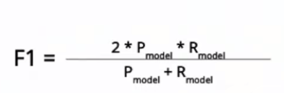

**F1** = (2 * 0.8226 * 0.816) / (0.8226 + 0.816) = 1.3424 / 1.6386 = 0.819